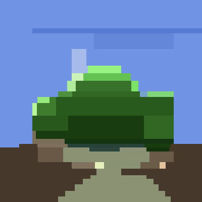

# ICFPC2022 Team manarimo
================================

# Team Members
* Keita Komuro
* Kenkou Nakamura (@kenkoooo)
* mkut
* Osamu Koga (@osa_k)
* Shunsuke Ohashi (@pepsin_amylase)
* Yu Fujikake (@yuusti)
* Yuki Kawata (@kawatea03)

# GitHub
* Organization icon "manarimo" illustration by @yuusti
* GitHub repository: https://github.com/manarimo/ICFPC2022/

# Portal site
* Solutions listing: http://icfpc2022-manarimo.s3-website-us-east-1.amazonaws.com/portal/#/solutions

# Main AI
* `kawatea/dp.cpp` - Dynamic programming based solver
* `object-object-visualizer/tools/plugin/freelunch.ts` - Color optimizer
* `object-object-visualizer/tools/plugin/rotator` - Rotation
* `object-object-visualizer/tools/plugin/shifter` - Image shifting
* `object-object-visualizer/tools/plugin/merger` - Merge initial blocks
* `object-object-visualizer/tools` - problem processing pipeline to run AI and applying pre/post processings

# Strategy
## Region segmentation
The basic strategy is splitting the image into thin strips and then painting them one by one. Strips are divided into
several segments, and each segment is painted with a single color. We use dynamic programming to find the optimal division
for segments within a strip, as well as the width of each strip.

To keep the cost of moves lower, we maintain the blocks connected as much as possible. Notably, we use the following techniques to achieve this:

* Cut only one side of the strip before painting it. Our AI paints the image from left to right, so it doesn't matter even if a paint move "overflows" to the right because they are overwritten later. The same applies to segments in a strip.
* When a strip is fully painted, it's merged back to the global block. It significantly reduces the cost of following cut moves.

## Color selection
The color of a segment is chosen from a precalculated color palette for the image. The palette consists of 50 colors sampled from the image.
While it makes the color selection by the AI suboptimal, it allows us to calculate the similarity of the segment in `O(1)` time with a precomputed cumulative sum table.

The output of AI is further processed by a postprocessor named `freelunch` to improve the color selection.
It groups pixels by the last `color` move that painted the pixel, then calculates the optimal color with
[Weiszfeld's algorithm](https://stackoverflow.com/questions/57277247/the-point-that-minimizes-the-sum-of-euclidean-distances-to-a-set-of-n-points).

## Rotating and shifting
As our AI paints an image from left to right, it suffers from the high cost of moves as it's close to the end. It results in rougher paintings because moves with smaller blocks become quickly unaffordable.
To avoid this problem, we rotate and shift the image so that a complex object appears near the left side of the image.
It is quite effective for images like problems 4 and 24, where an object is placed in the middle of the monotonic background.

## Initial blocks
For the problem with initial blocks, we merge all blocks initially because reusing those blocks is unrealistic due to the high cost of moves on small blocks.
We use a "zig-zag merging" approach to merge blocks:

* Merge 3 blocks vertically to create a column
* Then merge 3 of such columns to make a 3x3 block
* Cut the 3x3 block horizontally into 3 bars
* Extend each bar horizontally by 3 blocks
* Merge all bars and cut the block into columns
* Extend each column vertically by 3 blocks
* Repeat the process until we get a single block covering the whole image

# Overall impression of the contest
The problem specification was great. At first glance, it looked too simple, so we suspected an optimal solution could be quickly reached even by hand.
However, the cost setting of moves that become proportionally expensive to deal with smaller blocks kept betraying our intuition.
Combined with another unintuitiveness of similarity score of antialiased images, we had to keep exploring algorithmic ways to construct better solutions.
All of the challenges and visual output of the AI kept us excited throughout the contest.

We want to give a huge thanks to the organizer, who decided to hold a contest at the last minute.
We are happy to have this annual fun this year as well!